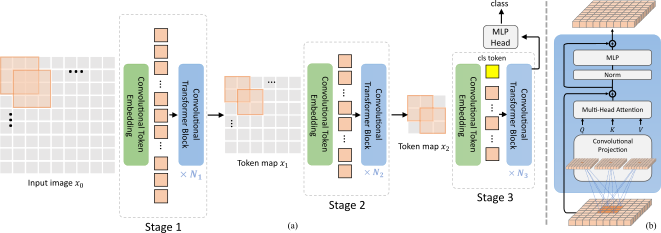
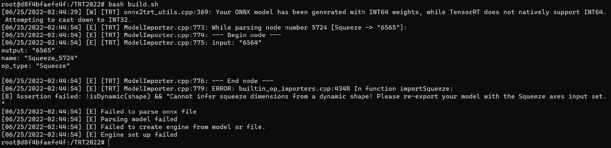
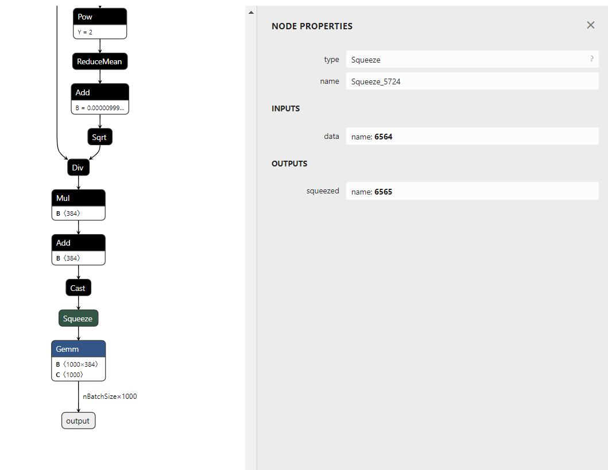
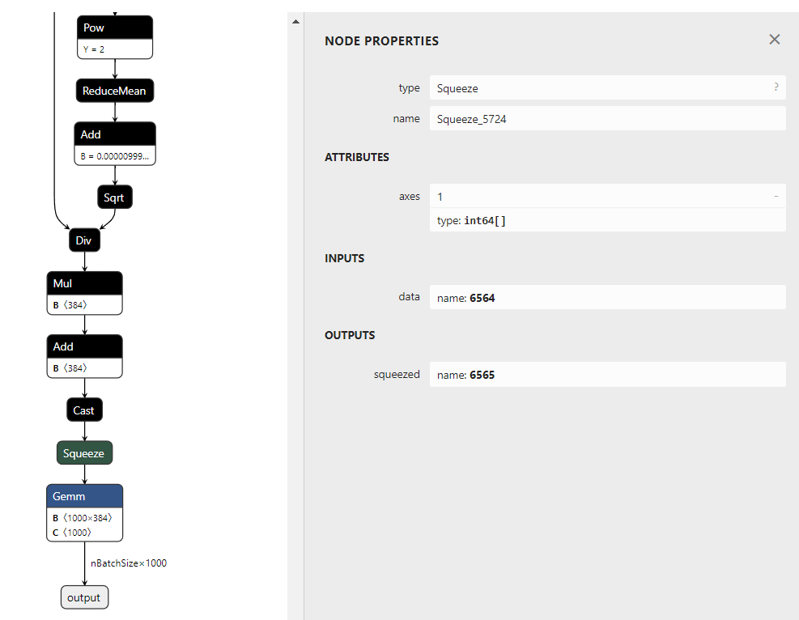
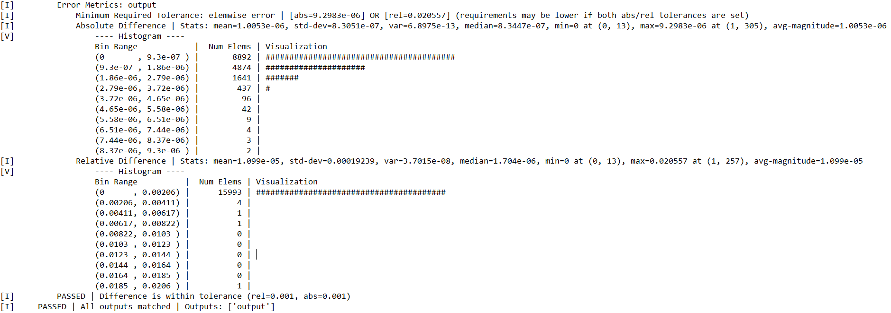

# 总述
本项目为我们（摆一摆队）在 TRT2022 复赛中完成的内容，主要贡献是选择了一个公开的视觉 Transformer 模型，将其部署到 TensorRT 上优化运行。
- **原始模型**：CvT，代码链接：[https://github.com/microsoft/CvT](https://github.com/microsoft/CvT)
- **优化效果**：FP32 模式下，模型的平均绝对误差为 1.0053e-06，平均相对误差为 1.099e-05，满足精度需求；Batch Size 为 1 时可取得约 4.33 倍的推理加速，Batch Size 为 8 时可取得约 1.18 倍的推理加速，随着 Batch Size 的增大，加速效果越小。
- **运行步骤**：
  1. 配置开发环境

     1）首先，下载 Nvidia 官方专门为本次复赛提供的 docker 镜像：

     ```
     docker pull registry.cn-hangzhou.aliyuncs.com/trt2022/trt-8.4-ga
     ```

     2）接着，创建并启动容器，取名为 TRT_CvT，并把源代码目录 ~/TRT2022 挂载到容器目录 /TRT2022：

     ```
     docker run --gpus all --shm-size 8G -it --name TRT_CvT -v ~/TRT2022:/TRT2022 registry.cn-hangzhou.aliyuncs.com/trt2022/trt-8.4-ga
     ```
     
     退出容器后，仍可通过 ```docker start -i TRT_CvT``` 将容器重新启动起来。

     3）最后，可参照[官方指引](https://pytorch.org/)来安装 1.7.1 版本的 PyTorch 和 TorchVision（CvT 模型在该版本上实现，其他版本没有经过充分测试），并通过 requirement.txt 文件安装本项目所需的依赖包和软件：

     ```
     python -m pip install -i https://pypi.mirrors.ustc.edu.cn/simple/ -r requirements.txt --user
     ```     

  1. 数据准备（若不需在 PyTorch 上测试模型精度可略过该步骤）
    
     需要按照如下格式准备数据：
      ``` sh
      |-DATASET
        |-imagenet
          |-train
          | |-class1
          | | |-img1.jpg
          | | |-img2.jpg
          | | |-...
          | |-class2
          | | |-img3.jpg
          | | |-...
          | |-class3
          | | |-img4.jpg
          | | |-...
          | |-...
          |-val
            |-class1
            | |-img5.jpg
            | |-...
            |-class2
            | |-img6.jpg
            | |-...
            |-class3
            | |-img7.jpg
            | |-...
            |-...
      ```

  1. 在 PyTorch 上加载模型并转为 ONNX 格式

     从[官方提供的预训练模型权重](https://1drv.ms/u/s!AhIXJn_J-blW9RzF3rMW7SsLHa8h?e=blQ0Al)中下载 **CvT-13-224x224-IN-1k.pth** 到项目根目录，
     从 **CvT-13-224x224-IN-1k.pth** 中加载 CvT 模型的预训练权重，并将模型从 PyTorch 格式转为 ONNX 格式：

     ```
     bash run.sh -t test --cfg experiments/imagenet/cvt/cvt-13-224x224.yaml TEST.MODEL_FILE CvT-13-224x224-IN-1k.pth
     ``` 
     - 若已在上一步骤准备数据，则可通过 ```--prepare_data 1``` 来测试模型精度。

     这一步骤可得到 PyTorch 格式模型 **CvT-13.pt** 和 ONNX 格式模型 **CvT-13.onnx**。
  
  1. 修改 ONNX 计算图
     
     为了使 ONNX 模型能被 TensorRT 顺利解析与优化，需对 ONNX 计算图进行修改：

     ```
     python CvT-13-Graphsurgeon.py
     ```

     这一步骤可得到修改后的 ONNX 模型 **CvT-13-Modify.onnx**。

  1. TensorRT 部署优化

     使用 TensorRT 对修改后的 ONNX 模型进行解析并自动选取相应优化，得到优化后的 TensorRT 模型：

     ```
     bash build.sh
     ```         

     最终获得 TensoRT 序列化模型 **CvT-13.plan**。
  
# 原始模型
## 模型简介
我们（摆一摆队）在本次 TRT2022 复赛中选题的原始模型来源于 ICCV 2021 一篇有关 Vision Transformer 的文章: [CvT: Introducing Convolutions to Vision Transformers](https://arxiv.org/abs/2103.15808)，CvT 模型的代码链接参见 Microsoft 公开的[官方实现](https://github.com/microsoft/CvT)。
- CvT 模型的提出主要是为了完成视觉领域的相关任务，如图像分类以及一些下游视觉任务。该模型在 ImageNet 数据集上的实验效果如下：
  - CvT 模型在 ImageNet-1k 预训练后的结果：

    | Model  | Resolution | Param | GFLOPs | Top-1 |
    |:------:|:----------:|:-----:|:------:|:-----:|
    | CvT-13 | 224x224    | 20M   | 4.5    | 81.6  |
    | CvT-21 | 224x224    | 32M   | 7.1    | 82.5  |
    | CvT-13 | 384x384    | 20M   | 16.3   | 83.0  |
    | CvT-21 | 384x384    | 32M   | 24.9   | 83.3  |
  - CvT 模型在 ImageNet-22k 预训练后的结果：

    | Model   | Resolution | Param | GFLOPs | Top-1 |
    |:-------:|:----------:|:-----:|:------:|:-----:|
    | CvT-13  | 384x384    | 20M   | 16.3   | 83.3  |
    | CvT-21  | 384x384    | 32M   | 24.9   | 84.9  |
    | CvT-W24 | 384x384    | 277M  | 193.2  | 87.6  |
- CvT 模型的整体结构如下图所示：

  

  借鉴了经典 CNN 模型的多阶段网络结构，CvT 模型也设计为 3 个阶段，每个阶段都包括 1 个 Token Embedding 步骤和多个 Transformer Block。与 ViT 模型不同的是，CvT 模型中的 Token Embedding 是通过卷积来实现的，且不需要额外的 Position Embedding ，并加入了额外的 Layer Normalization，这使得每个阶段能逐渐减少 Token 的数量，同时增加 Token 的宽度，以实现类似经典 CNN 设计的空间下采样并增强语义表示能力。在 Transformer 结构中，通过深度可分离卷积来替换传统 Self Attention QKV 的线性投影，以更高效地建模局部空间上下文信息。这种 CNN 和 Transformer 混合的结构，在保持 Transformer 特性（动态注意力、全局上下文信息、更好的泛化能力）的同时，也带来了 CNN 的优点（平移缩放不变性），实验结果也表明了其性能超过了 SOTA 的 CNN 和 Vision Transformer 模型。


## 模型优化的难点
模型在导出时、或用 Polygraphy/Trtexec 解析时、或在 TensorRT 运行时，可能会遇到某些结构无法识别、OP 不支持等问题，故可能需要修改模型计算图、开发 Plugin 等优化手段。

# 优化过程
### 1. PyTorch 模型转 ONNX 模型
由于原始模型是基于 PyTorch 框架构建的，故我们需要先将其转为 ONNX 格式，才能使 TensorRT 顺利地解析模型。

加载原始模型的预训练权重后，即可通过设置 ```torch.onnx.export()``` 函数来导出 ONNX 模型：
```
torch.onnx.export(model,
    torch.randn(16, 3, 224, 224, device="cuda"),
    "./CvT-13.onnx",
    input_names=["input"],
    output_names=["output"],
    do_constant_folding=True,
    verbose=True,
    keep_initializers_as_inputs=True,
    opset_version=12,
    dynamic_axes={"input": {0: "nBatchSize"}, "output": {0: "nBatchSize"}})
```
- 第 0 维表示数据的 Batch Size，第 1、2、3 维分别表示图像的通道数、高度、宽度。因此设置模型输入和输出的第 0 维为动态尺寸，导出的 ONNX 模型保存为 **CvT-13.onnx**。

### 2. 修改 ONNX 模型计算图
得到 ONNX 模型后，即可使用 TensorRT 来解析并自动对模型进行优化。不过在这之前有一个前提，那就是 ONNX 模型计算图中的所有结构和算子都需要 TensorRT 能够完整地识别和支持。

在运行 TensorRT 过程中，出现了如下错误：



从报错信息可以看到，TensorRT 解析编号为 5724 的 Squeeze 节点时，在动态尺寸下无法确定哪个维度将要被压缩，需要我们重新导出这个节点。

使用 Netron 软件查看 ONNX 模型计算图后也可以看出，该 Squeeze 节点确实没有指定需要压缩的维度：



通过查询 [ONNX 文档](https://github.com/onnx/onnx/blob/main/docs/Operators.md#squeeze)后，发现可以通过设置节点 Attributes 中的 axes 参数来指定需要压缩的维度。故使用 onnx_graphsurgeon 工具找到该 Squeeze 节点，并添加节点属性 ```Squeeze_5724.attrs["axes"] = np.array([1])```来指定压缩维度为 1 ，以完成计算图修改，修改后的 ONNX 模型保存为 **CvT-13-Modify.onnx**。

查看修改后的 ONNX 模型计算图可以发现，该 Squeeze 节点已经指定了压缩维度为 1：



### 3. TensorRT 运行优化
完成 ONNX 模型计算图修改后，就可以使用 TensorRT 来解析和运行了。Trtexec 和 Polygraphy 是两个非常便捷的工具，可以帮助我们经过简单的参数设置就能运行 TensorRT，而不用专门编写脚本程序。Polygraphy 还能够进行原始模型和 TensorRT 优化后模型的精度比较，故我们选择 Polygraphy 来运行 TensorRT：
```
polygraphy run CvT-13-Modify.onnx \
    --onnxrt --trt \
    --workspace 1000000000 \
    --save-engine=CvT-13.plan \
    --atol 1e-3 --rtol 1e-3 \
    --verbose \
    --trt-min-shapes input:[1,3,224,224] \
    --trt-opt-shapes input:[16,3,224,224] \
    --trt-max-shapes input:[32,3,224,224] \
    --input-shapes   input:[16,3,224,224] \
    > result-CvT-13-FP32.txt
```
- 我们最终可以获得 TensoRT 序列化模型 **CvT-13.plan**，精度比较结果保存在 **result-CvT-13-FP32.txt** 文件中。

# 精度与加速效果
### 云主机软硬件环境
- **操作系统：** Ubuntu 20.04.4 LTS (x86_64)
- **GPU：** NVIDIA A10
- **CUDA 版本：** 11.6
- **驱动版本：** 510.73.08
- **软件：** python 3.8、PyTorch 1.7.1、TensorRT 8.4.1

### 精度
原始模型与 TensorRT 优化后模型的精度比较见文件 **result-CvT-13-FP32.txt**：



| 模式 | 绝对误差最大值 | 绝对误差平均值 | 绝对误差中位数 |
|:----:|:-------------:|:-------------:|:-------------:|
| FP32 |  9.2983e-06   |  1.0053e-06   |  8.3447e-07   |

| 模式 | 相对误差最大值 | 相对误差平均值 | 相对误差中位数 |
|:----:|:-------------:|:-------------:|:-------------:|
| FP32 |   0.020557    |   1.099e-05   |   1.704e-06   |

- 在FP32 模式下，模型的平均绝对误差为 1.0053e-06，平均相对误差为 1.099e-05，满足精度需求。

### 性能
可测试模型分别在 PyTorch、ONNX Runtime、TensorRT 上的推理耗时来计算加速效果：

```
python testSpeedUp.py
```

|模型|模式|Batch Size|PyTorch 推理耗时|ONNX Runtime 推理耗时|TensorRT 推理耗时|加速比1|加速比2|
|:------:|:----:|:----:|:----------:|:----------:|:-----------:|:------:|:------:|
| CvT-13 | FP32 |  1   |  0.01504s  |  0.03361s  |   0.00347s  |  4.33  |  9.68  |
| CvT-13 | FP32 |  4   |  0.01634s  |  0.03834s  |   0.00777s  |  2.10  |  4.93  |
| CvT-13 | FP32 |  8   |  0.01657s  |  0.04526s  |   0.01398s  |  1.18  |  3.23  |
| CvT-13 | FP32 |  16  |  0.02566s  |  0.06119s  |   0.02357s  |  1.08  |  2.59  |
| CvT-13 | FP32 |  32  |  0.04969s  |  0.09003s  |   0.04912s  |  1.01  |  1.83  |

***** **注:**  加速比1表示 PyTorch 推理耗时比上 TensorRT 推理耗时，加速比2表示 ONNX Runtime 推理耗时比上 TensorRT 推理耗时。
- 在FP32 模式下，相比于 PyTorch 和 ONNX Runtime，TensorRT 在 Batch Size 为 1 时可取得约 4.33 倍和 9.68 倍的推理加速，Batch Size 为 8 时可取得约 1.18 倍和 3.23倍的推理加速。而随着 Batch Size 的增大，加速效果越小。
